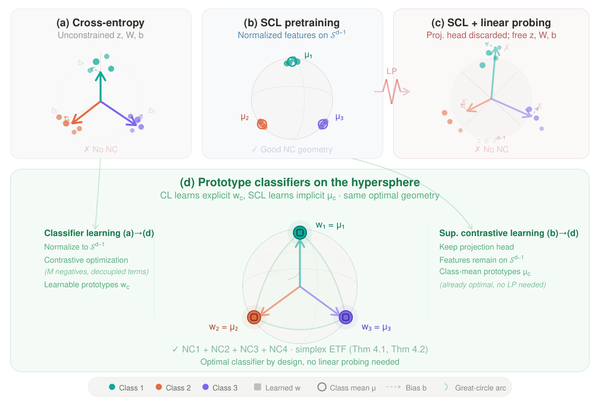

# Neural Collapse by Design: Learning Class Prototypes on the Hypersphere

[](https://icml.cc/Conferences/2026)
[](https://arxiv.org/abs/2605.20302)
[](LICENSE)
[](https://pytorch.org/)

## TL;DR

We propose a unified view of Supervised Learning as contrasting prototypes on the hypersphere, and introduce objectives that attain Neural Collapse, the optimum of Supervised Learning, in practice.

---

## Overview


<p align="center">
  
</p>

<p align="center"><strong>Accepted at ICML 2026</strong></p>

**NC is not attained in practice.** Cross-entropy (CE) and supervised contrastive learning (SCL) both fail to reach Neural Collapse (NC) in practice. CE never builds the geometry because radial degrees of freedom stay free. SCL builds the geometry during pretraining and then discards it through a linear probing phase on unnormalized features.

**A unified view of Supervised Learning.** We prove both are different appearances of the same method, prototype contrast on the unit hypersphere. NC is the shared optimum of both.

**NC in practice.** For CE, we propose normalized losses (NTCE, NONL) that import proper contrastive optimization (a large effective negative set, decoupled alignment and uniformity). For SCL, we propose fixed class-mean prototypes drawn directly from the projection head, replacing linear probing entirely.


---

## Results at a glance

|  |  |
|---|---|
| **ImageNet-1K (ResNet-50)** | NTCE **76.7%**, NONL 76.5%, CE 75.4% |
| **Neural Collapse geometry** | Normalized losses reach **≥95%** on NC metrics; CE never reaches NC |
| **Convergence speed** | Match CE's final NC in **under 7.5%** of CE's iterations (4 / 5 metrics) |
| **Transfer learning (8 datasets, mean)** | **+5.5%** over CE (NONL), up to +47.1% on Stanford Cars |
| **Long-tailed (imbalance 0.01)** | **+8.7%** on CIFAR-10-LT, +7.0% on CIFAR-100-LT |
| **SCL with fixed prototypes** | Matches linear probing on 3 / 4 datasets, **+2.0pp** on ImageNet-100, no LP phase |

Full numbers in the paper (Tables 1–6).

---

## Installation

```bash
git clone https://github.com/pakoromilas/nc_by_design.git
cd nc_by_design
pip install -r requirements.txt
```

Python 3.9+ and a CUDA-capable GPU.

---

## Quick start

Two entry points cover both halves of the paper.

**Classifier learning** with NONL on CIFAR-100:

```bash
python main_ce.py --cosine --warm --config=configs/ce_cifar.yaml \
    --loss=NONL --normalize --symmetric \
    --dataset=cifar100 --batch_size=512 --temperature=0.1
```

Swap `--loss` between `CE`, `NormFace`, `NTCE`, `NONL` to compare. `--normalize` is required for all three normalized losses; `--symmetric` is required for NTCE and NONL.

**Supervised contrastive learning** on CIFAR-100, with all four evaluation strategies in one run:

```bash
python main_supcon.py --cosine --warm --loss=SCL \
    --dataset=cifar100 --batch_size=128 --head_type=mlp --temperature=0.07
```

This runs SCL pretraining (Phase 1), then evaluates the encoder three ways: fixed class-mean prototypes (Phase 2, our method, Table 2), standard CE linear probing (Phase 3, baseline), and normalized linear probing (Phase 4, baseline).

---

## Repo map

- `main_ce.py`: classifier learning entry point. Trains the encoder and the linear head jointly under one of {CE, NormFace, NTCE, NONL}.
- `main_supcon.py`: SCL entry point. Runs four phases sequentially (contrastive pretraining, fixed-prototype evaluation, standard LP, normalized LP), with each skippable.
- `losses.py`: loss implementations (CE, NormFace, NTCE, NONL, SCL).
- `configs/`: YAML configs for each dataset and protocol.

---

## Citation

```bibtex
@misc{koromilas2026neuralcollapsedesignlearning,
      title={Neural Collapse by Design: Learning Class Prototypes on the Hypersphere}, 
      author={Panagiotis Koromilas and Theodoros Giannakopoulos and Mihalis A. Nicolaou and Yannis Panagakis},
      year={2026},
      eprint={2605.20302},
      archivePrefix={arXiv},
      primaryClass={cs.LG},
      url={https://arxiv.org/abs/2605.20302}, 
}
```

---

## Acknowledgments

This codebase is built on top of [SupContrast](https://github.com/HobbitLong/SupContrast) by Yonglong Tian, released under BSD-2-Clause. We thank all contributors for making their implementation available.

---

## Reference material

<details>
<summary><b>Full flag reference</b></summary>

**`main_ce.py`**

| Flag | Meaning |
|---|---|
| `--loss` | One of `CE`, `NormFace`, `NTCE`, `NONL`. |
| `--normalize` | L2-normalize features. Required for NormFace, NTCE, NONL. |
| `--symmetric` | Symmetric variant. Required for NTCE and NONL. |
| `--temperature` | Softmax temperature. Used by all losses except `CE`. |
| `--config` | YAML config (CLI flags override). |
| `--dataset` | `cifar10`, `cifar100`, `imagenet100`, `imagenet1k`. |
| `--cosine`, `--warm` | Cosine schedule and warmup. |

**`main_supcon.py`**

| Flag | Meaning |
|---|---|
| `--loss` | `SCL`. |
| `--head_type` | Projection head: `mlp`, `linear`, or `none`. |
| `--temperature` | Contrastive temperature. |
| `--skip_contrastive` | Skip Phase 1 (load checkpoint via `--supcon_ckpt`). |
| `--skip_prototype` | Skip Phase 2 (fixed-prototype evaluation). |
| `--skip_linear` | Skip Phase 3 (standard linear probing). |
| `--skip_normalized_linear` | Skip Phase 4 (normalized linear probing). |
| `--supcon_ckpt` | Path to a Phase-1 checkpoint when skipping contrastive. |

</details>

<details>
<summary><b>What each phase of <code>main_supcon.py</code> produces</b></summary>

**Phase 1, Contrastive pretraining.** Trains the encoder with the SCL loss on augmented two-view batches. Saves the final encoder checkpoint as `contrastive_final.pth` inside the run's output folder. Reports per-epoch contrastive loss. This is the most compute-heavy phase.

**Phase 2, Fixed-prototype evaluation (our method).** Freezes the encoder, computes one class-mean embedding per class over the training set (one forward pass per sample, no training), and evaluates classification accuracy by nearest-prototype matching on the validation set. Saves `phase2_prototypes.pth` with the prototype vectors, accuracy, and NC metrics. This is the paper's Table 2 fixed-prototype classifier, a training-free replacement for linear probing.

**Phase 3, Standard linear probing.** Freezes the encoder and trains a linear classifier with CE on top. Reports per-epoch train/val accuracy. Provides the LP baseline in Table 2.

**Phase 4, Normalized linear probing.** Freezes the encoder and trains a normalized linear classifier (NormFace by default; see `--linear_loss`) on the L2-normalized features. Reports per-epoch train/val accuracy. Provides the NLP baseline in Table 2.

Outputs land in `./save/UnifiedSupCon/<dataset>_models_SCL/<run_name>/`. The run name encodes the relevant hyperparameters (dataset, model, head type, learning rate, batch size, temperature, seed).

</details>

<details>
<summary><b>Loss name mapping</b></summary>

| Paper | CLI | Class in `losses.py` | Required flags |
|---|---|---|---|
| CE | `--loss=CE` | `torch.nn.CrossEntropyLoss` | (none) |
| NormFace | `--loss=NormFace` | `NormFace` | `--normalize` |
| NTCE | `--loss=NTCE` | `NTCE` | `--normalize --symmetric` |
| NONL | `--loss=NONL` | `NONL` | `--normalize --symmetric` |
| SCL | `--loss=SCL` | `SCL` | (for `main_supcon.py`) |

</details>
